# Output Format

イベントストーミング完了後の最終成果物markdownのフォーマット定義。

## 成果物の構成

最終成果物は以下の3セクションで構成する。

### セクション1：イベントストーミング全体図

mermaid図1枚で以下のすべてを統合して表現する：
- Bounded Context境界（subgraph）
- 集約（subgraphのネスト）
- イベント（橙ノード）
- コマンド（青ノード）
- ポリシー（紫ノード）
- アクター（黄ノード）
- 読み取りモデル（緑ノード）
- 外部システム（ピンクノード）
- フロー（矢印）

### セクション2：集約の詳細

テーブル形式で以下を記述する：
- 集約名
- 不変条件
- 含まれるコマンド / イベント
- ライフサイクル（状態遷移）
- 所属するBounded Context

### セクション3：ペインポイント・未解決事項

イベントストーミング中に特定されたペインポイントと未解決事項を一覧化する：
- 種別（知識のギャップ / プロセスのボトルネック / 矛盾する認識）
- 内容
- 関連するイベントや集約
- 推奨アクション（確認先、調査事項など）

---

## mermaid配色ルール

以下の配色を厳守する。

| 要素 | 色 | Hexコード | style指定 |
|------|------|-----------|-----------|
| アクター | 黄 | #fff8cc | `fill:#fff8cc,stroke:#e6d900,color:#333` |
| イベント | 橙 | #fcd4a5 | `fill:#fcd4a5,stroke:#e8a84c,color:#333` |
| ポリシー | 紫 | #c266e0 | `fill:#c266e0,stroke:#9b30c9,color:#fff` |
| コマンド | 青 | #99c6e4 | `fill:#99c6e4,stroke:#5a9bc7,color:#333` |
| 読み取りモデル | 緑 | #66be8f | `fill:#66be8f,stroke:#3a9e65,color:#333` |
| 外部システム | ピンク | #f2a0b7 | `fill:#f2a0b7,stroke:#d46a85,color:#333` |

---

## mermaidテンプレート

以下はmermaid図の構成テンプレート。実際のイベントストーミング結果に合わせて調整する。

ノードIDの命名規則：
- アクター: `actor_xxx`
- コマンド: `cmd_xxx`
- イベント: `evt_xxx`
- ポリシー: `pol_xxx`
- 読み取りモデル: `rm_xxx`
- 外部システム: `ext_xxx`

```mermaid
flowchart LR

  %% ===== Bounded Context: [BC名1] =====
  subgraph bc1["🔲 [BC名1]"]
    direction LR

    subgraph agg1["📦 [集約名1]"]
      actor_1["👤 [アクター名]"]
      cmd_1["[コマンド名]"]
      evt_1["[イベント名]"]

      actor_1 --> cmd_1
      cmd_1 --> evt_1
    end

    subgraph agg2["📦 [集約名2]"]
      pol_1{{"[ポリシー名]"}}
      cmd_2["[コマンド名]"]
      evt_2["[イベント名]"]
      rm_1[/"[読み取りモデル名]"/]

      pol_1 --> cmd_2
      rm_1 -.-> cmd_2
      cmd_2 --> evt_2
    end

    evt_1 --> pol_1
  end

  %% ===== Bounded Context: [BC名2] =====
  subgraph bc2["🔲 [BC名2]"]
    direction LR

    subgraph agg3["📦 [集約名3]"]
      pol_2{{"[ポリシー名]"}}
      cmd_3["[コマンド名]"]
      evt_3["[イベント名]"]

      pol_2 --> cmd_3
      cmd_3 --> evt_3
    end
  end

  %% ===== 外部システム =====
  ext_1(["🔌 [外部システム名]"])
  evt_2 --> ext_1
  ext_1 --> pol_2

  %% ===== BC間の依存関係 =====
  evt_1 -. "ドメインイベント" .-> pol_2

  %% ===== スタイル定義 =====
  style actor_1 fill:#fff8cc,stroke:#e6d900,color:#333

  style cmd_1 fill:#99c6e4,stroke:#5a9bc7,color:#333
  style cmd_2 fill:#99c6e4,stroke:#5a9bc7,color:#333
  style cmd_3 fill:#99c6e4,stroke:#5a9bc7,color:#333

  style evt_1 fill:#fcd4a5,stroke:#e8a84c,color:#333
  style evt_2 fill:#fcd4a5,stroke:#e8a84c,color:#333
  style evt_3 fill:#fcd4a5,stroke:#e8a84c,color:#333

  style pol_1 fill:#c266e0,stroke:#9b30c9,color:#fff
  style pol_2 fill:#c266e0,stroke:#9b30c9,color:#fff

  style rm_1 fill:#66be8f,stroke:#3a9e65,color:#333

  style ext_1 fill:#f2a0b7,stroke:#d46a85,color:#333

  style bc1 fill:none,stroke:#888,stroke-width:2px,stroke-dasharray:5 5
  style bc2 fill:none,stroke:#888,stroke-width:2px,stroke-dasharray:5 5

  style agg1 fill:#fffde7,stroke:#ccc,stroke-width:1px
  style agg2 fill:#fffde7,stroke:#ccc,stroke-width:1px
  style agg3 fill:#fffde7,stroke:#ccc,stroke-width:1px
```



### ノード形状の使い分け

| 要素 | mermaid記法 | 形状 |
|------|------------|------|
| アクター | `actor["👤 名前"]` | 四角 |
| コマンド | `cmd["名前"]` | 四角 |
| イベント | `evt["名前"]` | 四角 |
| ポリシー | `pol{{"名前"}}` | 六角形 |
| 読み取りモデル | `rm[/"名前"/]` | 平行四辺形 |
| 外部システム | `ext(["🔌 名前"])` | 角丸四角 |

### 矢印の使い分け

| 関係 | mermaid記法 | 意味 |
|------|------------|------|
| 直接フロー | `-->` | コマンド→イベント、アクター→コマンド |
| ポリシー起動 | `-->` | イベント→ポリシー→コマンド |
| データ参照 | `-.->` | 読み取りモデル→コマンド |
| BC間連携 | `-. "説明" .->` | ドメインイベントによるBC間連携 |

---

## 最終成果物テンプレート

```markdown
# イベントストーミング成果物：[Epic名]

実施日：YYYY-MM-DD
対象Epic：[Epicの概要を1〜2文で]

## 1. イベントストーミング全体図

[mermaid図をここに配置]

### 凡例
- 🔲 点線ボックス = Bounded Context
- 📦 薄黄色ボックス = 集約
- 👤 黄色 = アクター
- 橙色 = イベント
- 青色 = コマンド
- 紫色六角形 = ポリシー（自動ルール）
- 緑色平行四辺形 = 読み取りモデル
- 🔌 ピンク = 外部システム

## 2. 集約の詳細

| 集約名 | 所属BC | 不変条件 | コマンド | イベント | ライフサイクル |
|--------|--------|----------|----------|----------|----------------|
| [集約名] | [BC名] | [常に満たすべきルール] | [コマンド一覧] | [イベント一覧] | [状態遷移の概要] |

## 3. ペインポイント・未解決事項

| # | 種別 | 内容 | 関連要素 | 推奨アクション |
|---|------|------|----------|----------------|
| 1 | [知識のギャップ / ボトルネック / 矛盾する認識] | [内容] | [関連するイベントや集約] | [確認先・調査事項] |
```

---

## 図が大きくなりすぎる場合

イベント数が20を超えるなど図が大きくなりすぎる場合は、以下の対応を取る：

1. **BC単位で図を分割する**：全体概要図（BC間の依存関係のみ）＋ BC個別の詳細図
2. 全体概要図では集約をノードとして表現し、個別のイベント・コマンドは省略する
3. BC個別の詳細図で、そのBC内の全要素を表現する
